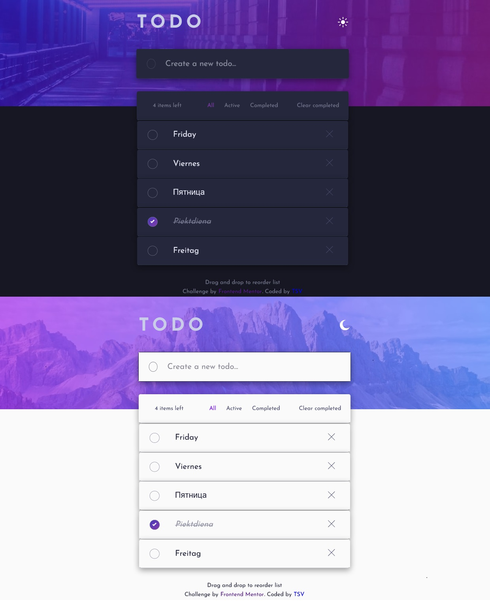

# Frontend Mentor - MERN Todo app solution

This is my MERN solution to the [Todo app challenge on Frontend Mentor](https://www.frontendmentor.io/challenges/todo-app-Su1_KokOW). Frontend Mentor challenges help you improve your coding skills by building realistic projects.

## Table of contents

- [Overview](#overview)
  - [The challenge](#the-challenge)
  - [Screenshot](#screenshot)
  - [Links](#links)
- [My process](#my-process)
  - [Built with](#built-with)
  - [What I learned](#what-i-learned)
  - [Continued development](#continued-development)
  - [Useful resources](#useful-resources)
- [Author](#author)
- [Acknowledgments](#acknowledgments)

**Note: Delete this note and update the table of contents based on what sections you keep.**

## Overview

### The challenge

Users should be able to:

- Add new todos to the list and save it in the database.
- Mark todos as complete and save it in the database.
- Play sound checking complete todos
- Delete todos from the list and the database.
- Play sound deleting todos
- Filter by all/active/complete todos
- Clear all completed todos
- Toggle light and dark mode
- Drag and drop to reorder items on the list
- View the optimal layout for the app depending on their device's screen size
- See hover states for all interactive elements on the page
- Toggle light and dark mode

### Screenshot

### Links

- Solution URL: [Add solution URL here](https://your-solution-url.com)
- Live Site URL: [https://mern-todosortable.herokuapp.com/]

## My process

### Built with

- MERN (MongoDB, Express, React and Node) CRUD
- [React](https://reactjs.org/) - JS library
- ReactJS Hooks, Context, Sounds, Sortable...
- Semantic HTML5 markup
- CSS custom properties
- Flexbox
- CSS Grid
- CSS variables
- Mobile-first workflow

### What I learned

I have learned how to:

- use ReactJS with Node.js & MongoDB
- connect ReactJS Sortable with Node.js & MongoDB
- use CSS variables

### Continued development

I plan to continue to:

- add user Auths
- add Edit option for todo

### Useful resources

- [https://youtu.be/Pfg-cGGzEqs] - This helped me a lot with Sortable.
- [https://youtu.be/35BSnmTbjlE?t=5128] - This helped me magnifically with deployment on Heroku.

## Author

- GitHub - [https://github.com/tsvGithub]
- Frontend Mentor - [@tsvGithub https://www.frontendmentor.io/profile/tsvGithub]

## Acknowledgments

I have to thanks Frontend Mentor for inspiration, best challenges and chance to practice and learning new knowledge 🌹
